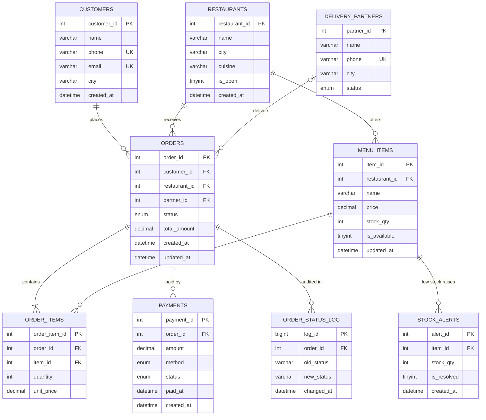

## Entity Relationship Diagram

```mermaid
erDiagram
    CUSTOMERS ||--o{ ORDERS : places
    RESTAURANTS ||--o{ ORDERS : receives
    DELIVERY_PARTNERS |o--o{ ORDERS : delivers
    ORDERS ||--|{ ORDER_ITEMS : contains
    MENU_ITEMS ||--o{ ORDER_ITEMS : "ordered as"
    RESTAURANTS ||--o{ MENU_ITEMS : offers
    ORDERS ||--o{ PAYMENTS : "paid by"
    ORDERS ||--o{ ORDER_STATUS_LOG : "audited in"
    MENU_ITEMS ||--o{ STOCK_ALERTS : "low stock raises"

    CUSTOMERS {
        int customer_id PK
        varchar name
        varchar phone UK
        varchar email UK
        varchar city
        datetime created_at
    }

    RESTAURANTS {
        int restaurant_id PK
        varchar name
        varchar city
        varchar cuisine
        tinyint is_open
        datetime created_at
    }

    MENU_ITEMS {
        int item_id PK
        int restaurant_id FK
        varchar name
        decimal price
        int stock_qty
        tinyint is_available
        datetime updated_at
    }

    DELIVERY_PARTNERS {
        int partner_id PK
        varchar name
        varchar phone UK
        varchar city
        enum status
    }

    ORDERS {
        int order_id PK
        int customer_id FK
        int restaurant_id FK
        int partner_id FK
        enum status
        decimal total_amount
        datetime created_at
        datetime updated_at
    }

    ORDER_ITEMS {
        int order_item_id PK
        int order_id FK
        int item_id FK
        int quantity
        decimal unit_price
    }

    PAYMENTS {
        int payment_id PK
        int order_id FK
        decimal amount
        enum method
        enum status
        datetime paid_at
        datetime created_at
    }

    ORDER_STATUS_LOG {
        bigint log_id PK
        int order_id FK
        varchar old_status
        varchar new_status
        datetime changed_at
    }

    STOCK_ALERTS {
        int alert_id PK
        int item_id FK
        int stock_qty
        tinyint is_resolved
        datetime created_at
    }
```
